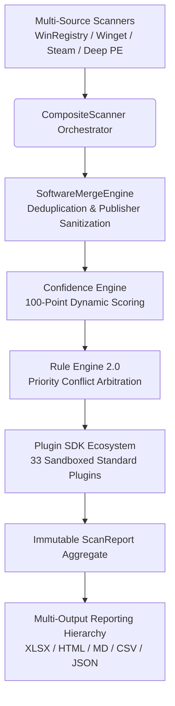

# License Intelligence Platform (LIP) v1.0

<div align="center">


**Hệ Thống Kiểm Kê Phần Mềm & Rà Soát Giấy Phép Bản Quyền Tự Động Chuẩn Doanh Nghiệp**  
*(Enterprise-Grade Read-Only Software Inventory & Automatic License Verification Engine)*

[Tích hợp Excel 4 Tabs (.XLSX)](#-bộ-xuất-báo-cáo-đa-định-dạng-phase-4-enterprise-exporters) • [Giao diện Web Widescreen 1920x1080](#-bộ-xuất-báo-cáo-đa-định-dạng-phase-4-enterprise-exporters) • [Hướng Dẫn Chạy Nhanh](#-hướng-dẫn-cài-đặt--sử-dụng-quick-start) • [Tài Liệu Kiến Trúc](#-tài-liệu-kiến-trúc--kỹ-thuật-documentation-index)

</div>

---

## 💡 Giới Thiệu (`Overview`)

**License Intelligence Platform (LIP)** là giải pháp nền tảng kiểm kê toàn diện và thông minh hóa rà soát giấy phép phần mềm trên hệ sinh thái **.NET 8 Clean Architecture**. Được thiết kế chuyên biệt cho các Giám đốc CNTT (CIO/IT Director), Chuyên viên Bảo mật và Kiểm toán viên Pháp lý, LIP giải quyết triệt để rủi ro vi phạm bản quyền thương mại và tuân thủ mã nguồn mở mà không gây ảnh hưởng đến sự ổn định của hệ thống.

### 🛡️ 3 Nguyên Tắc Bảo Mật & Pháp Lý Cốt Lõi:
1. **100% Read-Only (Chỉ Đọc & Không Xâm Nhập):** Toàn bộ bộ quét (`WindowsRegistryScanner`, `DeepFileSystemScanner`, `SteamGameScanner`) hoạt động ở chế độ chỉ đọc tối thượng (`EnumerateFiles`, `Get-ItemProperty`). **Cấm tuyệt đối** mọi hành vi ghi, sửa đổi hay xóa tệp tin / key Registry.
2. **100% Air-Gapped (Quét Offline Cục Bộ):** Toàn bộ quá trình quét danh mục, phân tích chữ ký số Authenticode và khớp tri thức bản quyền diễn ra hoàn toàn trên RAM máy trạm trong $\sim 500\text{ms}$. **Không có bất kỳ kết nối internet hay gửi dữ liệu telemetry nào ra bên ngoài**.
3. **Anti-Tamper Signature & Read-Only Lock (Chống Giả Mạo Báo Cáo):** Mọi báo cáo xuất ra đều được tự động tính toán mã băm **SHA-256 Checksum Signature** và khóa thuộc tính **Chỉ đọc (`FileAttributes.ReadOnly`)**, ngăn chặn mọi hành vi chỉnh sửa làm sai lệch hồ sơ kiểm toán.

---

## 🏗️ Kiến Trúc Core Engine 2.0 (`Key Architectural Innovations`)

Hệ thống được phát triển hoàn thiện 100% theo các chuẩn mực thiết kế cao nhất từ **Phase 0 đến Phase 4**:



- **Rule Engine 2.0 (`PluginPriority Conflict Resolution`):** Giải quyết xung đột nhận diện thông minh. Khi nhiều Plugin cùng khớp 1 phần mềm, hệ thống tự động ưu tiên theo mức độ tin cậy (`ConfidenceLevel`), tổng điểm trọng số bằng chứng (`Evidence Weight`) và thứ tự ưu tiên của Plugin (`CommercialSpecific = 100`, `Ecosystem = 75`, `Heuristic = 50`).
- **Confidence Engine (`100-Point Scoring System`):** Loại bỏ sự cảm tính bằng thang điểm động 100 điểm: Header file license (+40-50 pts), Chữ ký số Authenticode (+25-30 pts), Registry Key (+15-20 pts), Heuristic Match (+10 pts).
- **Software Merge Engine (`Deduplication & Sanitization`):** Gộp thông minh các bản ghi trùng lặp từ Registry 32-bit / 64-bit dựa trên GUID `ProductCode` và tự động chuẩn hóa tên nhà xuất bản (*Microsoft Corp / Microsoft Corporation $\to$ Microsoft Corporation*).
- **Sandboxed Error Isolation (`Rule 9 Boundary`):** Bọc 100% lời gọi Plugin trong vòng `try/catch` cùng cơ chế bảo vệ **Linked CancellationTokenSource Timeout 5000ms**, bảo vệ hệ thống **Zero-Crash** ngay cả khi gặp lỗi I/O hay plugin bên thứ ba treo vô hạn.

---

## 📊 Bộ Xuất Báo Cáo Đa Định Dạng Phase 4 (`Enterprise Exporters`)

Toàn bộ thời gian trong báo cáo được chuẩn hóa về **Giờ Việt Nam (`VN Time - UTC+7`)**. Sau khi chạy xong, thư mục `reports/` tự động sinh ra 6 định dạng chuyên biệt:

### 1. 📗 Bảng Tính Excel Chuẩn Doanh Nghiệp (`.xlsx` — Multi-Sheet Enterprise Workbook)
Được xây dựng trên thư viện `ClosedXML` chuẩn OpenXML với thiết kế sang trọng, tự động chia thành **4 Trang tính (Tabs)**:
- **`Executive Dashboard`**: Bảng điều khiển KPI tổng hợp, tỷ lệ phần trăm các nhóm bản quyền (`Commercial`, `Open Source`, `Freeware`, `Verified`).
- **`Full Inventory & Audit`**: Danh mục chi tiết 130+ phần mềm. Tự động đóng băng dòng tiêu đề (`Freeze Top Row`), bật bộ lọc tự động (`Auto-Filter`) và tô màu theo ngữ cảnh:
  - 🔴 **Màu hồng nhạt (`#FEE2E2`)**: Phần mềm thương mại (`Commercial`) cần kiểm tra giấy phép mua sắm.
  - 🔵 **Màu xanh dương nhạt (`#E0F2FE`)**: Phần mềm mã nguồn mở (`OpenSource`).
  - 🟢 **Màu xanh lá (`#DCFCE7`)**: Các phần mềm đã được xác minh chính xác bằng Plugin (`Verified`).
- **`Commercial Licenses (Action)`**: Lọc riêng các phần mềm thương mại (`Docker Desktop`, `Figma`, `TablePlus`, `Unity`, `SQL Server`...) cho bộ phận tài chính/pháp chế kiểm kê.
- **`Open Source Compliance`**: Lọc riêng các phần mềm mã nguồn mở kèm bằng chứng giấy phép (MIT, Apache 2.0, GPL...).

### 2. 🌐 Báo Cáo Trực Quan Web HTML (`.html` — Widescreen 1920x1080)
Giao diện Dark Mode sang trọng (`#0F172A`), tối ưu tỷ lệ hiển thị cho **màn hình Full HD Widescreen 16:9**. Tự động cố định Header bảng (`Sticky Header`), không bao giờ bị cắt chữ hay tràn viền và hỗ trợ in trực tiếp sang PDF.

### 3. 📑 Hồ Sơ Kiểm Toán Pháp Lý (`.md` — Audit Legal Report)
Báo cáo Markdown chi tiết dành cho kiểm toán viên và luật sư sở hữu trí tuệ, liệt kê rạch ròi từng gói phần mềm, mức độ tự tin và trích dẫn trực tiếp nguồn bằng chứng (`Evidence Source`).

### 4. 🗄️ Dữ Liệu Tích Hợp Hệ Thống (`.csv` & `.json`)
Chuẩn hóa cấu trúc dữ liệu để nạp tự động vào hệ thống quản lý tài sản ERP, SIEM hoặc tích hợp vào các pipeline CI/CD.

### 5. 🤖 Danh Sách Tự Học Tồn Đọng (`backlog_need_plugins.json`)
Tự động thống kê các phần mềm lạ chưa có Plugin nhận diện chuyên sâu, giúp đội ngũ kỹ thuật có cơ sở mở rộng bộ Plugin SDK trong tương lai.

---

## 🚀 Hướng Dẫn Cài Đặt & Sử Dụng (`Quick Start`)

### Cách 1: Sử Dụng Bản Chạy Độc Lập (`Standalone Windows Executable`)
Bạn **không cần cài đặt .NET SDK hay bất kỳ dependency nào** trên máy trạm. Chỉ cần tải bản phát hành `LicenseIntelligencePlatform-v1.0.0-win-x64.zip`:

1. Giải nén thư mục `LicenseIntelligencePlatform-v1.0.0-win-x64`.
2. Nhấp đúp chuột vào file **`LicenseIntelligencePlatform.Presentation.Cli.exe`**.
3. Quá trình quét hoàn tất trong nháy mắt ($\sim 500\text{ms}$). Mở thư mục **`reports/`** ngay bên cạnh để xem báo cáo Excel `.xlsx`, Web `.html`, `.md`...

### Cách 2: Chạy Từ Command Line / DevOps Pipeline
```powershell
# Chạy và tự động thoát khi xong (không dừng chờ phím Enter)
.\LicenseIntelligencePlatform.Presentation.Cli.exe --no-pause

# Chỉ xuất báo cáo ra định dạng XLSX và HTML tại thư mục chỉ định
.\LicenseIntelligencePlatform.Presentation.Cli.exe --format XLSX,HTML --output "D:\AuditReports\2026_Q3" --no-pause

# Xem toàn bộ tham số cấu hình nâng cao
.\LicenseIntelligencePlatform.Presentation.Cli.exe --help
```

### Cách 3: Biên Dịch & Kiểm Thử Từ Mã Nguồn (`For Developers`)
Yêu cầu hệ thống: **.NET 8.0 SDK** trở lên.

```powershell
# 1. Clone kho lưu trữ
git clone https://github.com/balocvu3105-dd/LicenseIntelligencePlatform.git
cd LicenseIntelligencePlatform

# 2. Chạy toàn bộ bộ kiểm thử tự động (37/37 Unit Tests)
dotnet test src/LicenseIntelligencePlatform.slnx -c Release

# 3. Chạy công cụ CLI trực tiếp từ mã nguồn
dotnet run --project src/LicenseIntelligencePlatform.Presentation.Cli -- -f XLSX,HTML --no-pause

# 4. Đóng gói bản chạy độc lập cho Windows x64 (Single-File Self-Contained)
dotnet publish src/LicenseIntelligencePlatform.Presentation.Cli -c Release -r win-x64 --self-contained true /p:PublishSingleFile=true -o ./dist/win-x64
```

---

## 📂 Cấu Trúc Dự Án (`Project Structure — Clean Architecture`)

```text
License-Intelligence-Platform-Docs/
├── docs/                                  # Bộ tài liệu kiến trúc & đặc tả (ADR, Domain Model, Roadmap...)
├── src/
│   ├── LicenseIntelligencePlatform.Domain/              # Core Domain: Entities, Enums, Immutable Records
│   ├── LicenseIntelligencePlatform.Application/         # Use Cases: CoreEngine, MergeEngine, RuleEngine
│   ├── LicenseIntelligencePlatform.Plugins.Standard/    # Bộ 33 Sandboxed Standard Plugins cho hệ sinh thái
│   ├── LicenseIntelligencePlatform.Infrastructure/      # Scanners (Registry, Winget, Steam) & 6 Report Mappers
│   ├── LicenseIntelligencePlatform.Presentation.Cli/    # Điểm truy cập CLI, Dependency Injection Container
│   └── LicenseIntelligencePlatform.Tests/               # Bộ 37 Unit Tests kiểm tra tính toàn vẹn hệ thống
└── dist/
    └── LicenseIntelligencePlatform-v1.0.0-win-x64/      # Bộ sản phẩm phát hành độc lập kèm Hướng dẫn sử dụng
```

---

## 📚 Tài Liệu Kiến Trúc & Kỹ Thuật (`Documentation Index`)

Kho tài liệu kiến trúc chi tiết được lưu trữ trong thư mục `docs/`:

| Tài Liệu | Mô Tả Trọng Tâm |
| :--- | :--- |
| [00_PROJECT_VISION.md](file:///docs/00_PROJECT_VISION.md) | Tầm nhìn chiến lược, tuyên ngôn giá trị và các nguyên tắc bất biến |
| [02_ARCHITECTURE.md](file:///docs/02_ARCHITECTURE.md) | Kiến trúc tổng thể Clean Architecture 5 tầng & SOLID |
| [03_DOMAIN_MODEL.md](file:///docs/03_DOMAIN_MODEL.md) | Chi tiết các thực thể (`ScanReport`, `SoftwareInfo`, `Evidence`, `ConfidenceLevel`) |
| [04_USER_GUIDE_AND_EXPORTERS.md](file:///docs/04_USER_GUIDE_AND_EXPORTERS.md) | Cẩm nang hướng dẫn sử dụng và giải thích 6 định dạng báo cáo Phase 4 |
| [05_SECURITY_MODEL.md](file:///docs/05_SECURITY_MODEL.md) | Mô hình bảo mật 100% Read-Only, Air-Gapped & Anti-Tamper SHA-256 |
| [08_ARCHITECTURE_ROADMAP.md](file:///docs/08_ARCHITECTURE_ROADMAP.md) | Bản đồ định hướng kiến trúc kỹ thuật từ Phase 1 đến Phase 4 |
| [09_PLUGIN_DEVELOPMENT_GUIDE.md](file:///docs/09_PLUGIN_DEVELOPMENT_GUIDE.md) | Hướng dẫn phát triển Plugin mới tuân thủ SDK v1.0 & Sandboxed Sandbox |
| [13_PRODUCT_ROADMAP.md](file:///docs/13_PRODUCT_ROADMAP.md) | Bảng theo dõi hoàn thành 100% các cột mốc sản phẩm (`Milestones 0–4`) |

---

<div align="center">

**Bản quyền thuộc về Bá Lộc Vũ (DynamiteV) • All Rights Reserved**  
*Xây dựng với lòng đam mê kiến trúc phần mềm sạch (`Clean Architecture + SOLID`)*

</div>
