# 02_ARCHITECTURE.md

# License Intelligence Platform (LIP)

## 02 · Enterprise Clean Architecture Specification

Version: 1.0

Status: Stable (Phase 0 – Phase 4 Completed)

Author: DynamiteV

---

# 1. Architectural Principles & Core Philosophy

**License Intelligence Platform (LIP)** được kiến trúc và phát triển trên nền tảng **.NET 8 LTS**, tuân thủ nghiêm ngặt mô hình **Clean Architecture 5 tầng** kết hợp với các nguyên tắc **SOLID** và **Zero-Allocation Idioms**.

Kiến trúc LIP được định hình bởi 4 nguyên tắc tối thượng (`Immutable Architectural Invariants`):
1. **Strict Dependency Rule (Quy tắc phụ thuộc một chiều hướng nội):** Tầng `Domain` là trái tim của hệ thống, hoàn toàn không phụ thuộc vào bất kỳ tầng nào khác. Các tầng ngoại vi (`Infrastructure`, `Plugins.Standard`, `Presentation.Cli`) chỉ được phép tham chiếu hướng vào trong qua các abstraction Interfaces (`IScanner`, `ILicensePlugin`, `IReportMapper`, `ICoreEngine`).
2. **Zero-Harm Read-Only Isolation (`Rule 3 & Rule 6`):** Toàn bộ các bộ quét (`Scanners`) chỉ truy xuất dữ liệu từ hệ điều hành ở chế độ đọc (`File.OpenRead`, `Registry.OpenSubKey writable: false`). Các Plugin không bao giờ tự ý truy cập OS trực tiếp mà chỉ phân tích đối tượng `SoftwareInfo` nhận được từ Core Engine.
3. **Sandboxed Error Isolation Boundary (`Rule 9`):** Lỗi của một Plugin hoặc một Scanner không bao giờ được phép lan truyền làm sập tiến trình chính. Mọi lời gọi ngoại vi hoặc execution của Plugin đều được bọc trong vòng lặp `try/catch + CancellationToken 5000ms Timeout Guard`.
4. **OCP Extensibility (Open/Closed Principle):** Hệ thống có thể mở rộng không giới hạn (thêm Scanner mới, Plugin nhận diện mới, hoặc định dạng báo cáo Phase 4 mới) bằng cách tạo class implement interface tương ứng và đăng ký vào DI Container (`Program.cs`) mà không cần thay đổi dù chỉ một dòng code trong `CoreEngine`.

---

# 2. 5-Layer Clean Architecture Overview

```
┌──────────────────────────────────────────────────────────────────────────────────┐
│                             1. Presentation.Cli Layer                            │
│     (Program.cs, CliOptions, Console Table Rendering, DI Container Wiring)       │
└────────────────────────────────────────┬─────────────────────────────────────────┘
                                         │ Calls & Configures
                                         ▼
┌──────────────────────────────────────────────────────────────────────────────────┐
│                              2. Application Layer                                │
│       (CoreEngine, SoftwareMergeEngine, PluginCompatibilityValidator)            │
└──────────────────┬─────────────────────────────────────────────┬─────────────────┘
                   │ Implements Interfaces                       │ Uses & Implements
                   ▼                                             ▼
┌──────────────────────────────────────┐     ┌─────────────────────────────────────┐
│       3. Infrastructure Layer        │     │      4. Plugins.Standard Layer      │
│  • Scanners: WindowsRegistry, Linux  │     │  • 33 Production Standard Plugins   │
│    Package, Winget, DeepFileSystem   │     │  • Commercial Suite (Adobe, Office) │
│  • Exporters (Phase 4): Csv, Json,   │     │  • Ecosystems (Docker, Steam, IDE)  │
│    Audit MD, Html Visual, Stats BI   │     │  • Heuristic & Generic Detectors    │
└──────────────────┬───────────────────┘     └──────────────────┬──────────────────┘
                   │ Implements Interfaces                      │ Implements ILicensePlugin
                   └──────────────────┬─────────────────────────┘
                                      ▼
┌──────────────────────────────────────────────────────────────────────────────────┐
│                                 5. Domain Layer                                  │
│   • Entities: SoftwareInfo, LicenseCheckResult, Evidence, PluginManifest         │
│   • Interfaces: IScanner, ILicensePlugin, IReportMapper, ICoreEngine             │
│   • Enums: LicenseType (Commercial, OpenSource...), ConfidenceLevel (0-4)        │
└──────────────────────────────────────────────────────────────────────────────────┘
```

---

# 3. Layer Specifications & Responsibilities

## 3.1. Domain Layer (`LicenseIntelligencePlatform.Domain`)
- **Trách nhiệm:** Định nghĩa mô hình thực thể nghiệp vụ (`Entities`), hợp đồng giao diện (`Interfaces`), và các kiểu dữ liệu liệt kê (`Enums`) của nền tảng.
- **Đặc điểm kiến trúc:**
  - `100% Pure C# / Zero Dependencies:` Không tham chiếu bất kỳ thư viện NuGet ngoại vi nào ngoài `.NET Standard / Core`.
  - `Strict Immutability:` Các Entity như `SoftwareInfo`, `Evidence`, `PluginManifest`, và `LicenseCheckResult` đều là `sealed record` bất biến sau khi khởi tạo (`init-only properties`).

## 3.2. Application Layer (`LicenseIntelligencePlatform.Application`)
- **Trách nhiệm:** Chứa đựng toàn bộ logic điều phối và các Engine xử lý cốt lõi của Phase 1 & Phase 2.
- **Các thành phần cốt lõi:**
  - `CoreEngine`: Trái tim điều phối tiến trình quét `ExecuteFullScanAsync(cancellationToken)`. Gọi `CompositeScanner` để lấy dữ liệu thô, gọi `SoftwareMergeEngine` để loại bỏ trùng lặp, sau đó điều phối danh sách `ILicensePlugin` theo `PluginPriority` (`Rule Engine 2.0`).
  - `SoftwareMergeEngine`: Áp dụng thuật toán Deduplication (khớp GUID `ProductCode`, cặp `Name + Version`, chuẩn hóa nhà phát hành `Sanitize Publisher`) để gộp các bản ghi giống nhau giữa Registry 32/64 bit và WinGet.
  - `PluginCompatibilityValidator`: Chẩn đoán và từ chối nạp vào RAM các Plugin có `MinSdkVersion` cao hơn `CurrentSdkVersion` (`"1.0.0"`).

## 3.3. Infrastructure Layer (`LicenseIntelligencePlatform.Infrastructure`)
- **Trách nhiệm:** Giao tiếp trực tiếp với các tài nguyên cụ thể của hệ điều hành và hệ thống file theo cơ chế chỉ đọc (`Read-Only`).
- **Phân hệ Scanners (Phase 0 & Phase 3):**
  - `WindowsRegistryScanner`: Quét `HKLM\SOFTWARE\Microsoft\Windows\CurrentVersion\Uninstall` (32-bit & 64-bit) và `HKCU`.
  - `LinuxPackageScanner`: Phân tích `/var/lib/dpkg/status` trên Linux.
  - `WingetPackageScanner`: Đọc repository JSON cục bộ của Windows Package Manager.
  - `DeepFileSystemScanner`: Quét tiến trình đang chạy trong RAM và kiểm tra metadata file thực thi PE (`.exe`, `.dll`).
  - `CompositeScanner`: Orchestrator gộp và chạy đồng bộ tất cả các Scanner hợp lệ trên nền tảng hiện tại.
- **Phân hệ Exporters / Report Mappers (Phase 4):**
  - Đăng ký trọn bộ 5 Mappers: `AuditReportMapper` (`AUDIT`), `HtmlReportMapper` (`HTML`), `StatisticsReportMapper` (`STATS`), `CsvReportMapper` (`CSV`), `JsonReportMapper` (`JSON`), kèm theo `ExecutiveSummaryMapper` và `EvidenceReportMapper`.

## 3.4. Plugins.Standard Layer (`LicenseIntelligencePlatform.Plugins.Standard`)
- **Trách nhiệm:** Đóng gói tập hợp **33 Standard Plugins** nhận diện bản quyền chuyên sâu của hệ thống.
- **Đặc điểm thực thi:** Mọi plugin implement `ILicensePlugin`, khai báo `PluginManifest`, áp dụng thang điểm 100 của `Confidence Engine` (+40-50 pts cho file license header, +25-30 pts cho chữ ký số Authenticode), và tuân thủ tuyệt đối tốc độ `CanCheck < 1 ms`.

## 3.5. Presentation.Cli Layer (`LicenseIntelligencePlatform.Presentation.Cli`)
- **Trách nhiệm:** Điểm 진 nhập duy nhất (`Entry Point`) khi người dùng hoặc hệ thống CI/CD chạy lệnh từ terminal.
- **Các thành phần:**
  - `Program.cs`: Thiết lập Dependency Injection Container (`Microsoft.Extensions.DependencyInjection`), đăng ký toàn bộ `Services`, `Scanners`, `Plugins`, và `ReportMappers`.
  - `CliOptions`: Phân tích tham số dòng lệnh (`--format BOTH`, `--output reports/`, `--plugins ...`).
  - `Summary Rendering & Backlog Exporter`: In bảng tổng kết màu sắc ra Terminal và xuất đồng thời 5 báo cáo Phase 4 cùng file `backlog_need_plugins.json`.

---

# 4. End-to-End System Execution Sequence Pipeline

```mermaid
sequenceDiagram
    autonumber
    actor User as CLI User / CI Pipeline
    participant CLI as Presentation.Cli (Program.cs)
    participant Core as ICoreEngine (CoreEngine)
    participant Merge as ISoftwareMergeEngine
    participant Scan as CompositeScanner (IScanner)
    participant Plg as ILicensePlugin (33 Plugins)
    participant Exp as IReportMapper (5 Phase 4 Mappers)

    User->>CLI: dotnet run --format BOTH --output reports/
    CLI->>Core: ExecuteFullScanAsync(cancellationToken)
    
    rect rgb(15, 23, 42)
        Note over Core, Scan: Phase 3 Multi-Source Inventory Scan
        Core->>Scan: ScanAsync(cancellationToken)
        Scan-->>Core: Returns IReadOnlyList<SoftwareInfo> (Raw: 106+ items)
    end

    rect rgb(30, 41, 59)
        Note over Core, Merge: Phase 2 & Phase 3 Deduplication Pipeline
        Core->>Merge: MergeDuplicates(rawSoftwareList)
        Merge-->>Core: Returns Merged & Sanitized Software List
    end

    rect rgb(15, 23, 42)
        Note over Core, Plg: Phase 1 Rule Engine 2.0 & Confidence Evaluation
        loop For Each Software in Merged List
            Core->>Plg: Sort Plugins by Priority (Rule Engine 2.0)
            Core->>Plg: CanCheck(software) [Speed < 1ms]
            alt CanCheck == true
                Core->>Plg: CheckLicenseAsync(software, token) [Sandboxed try/catch + 5000ms Timeout]
                Plg-->>Core: Returns LicenseCheckResult with Evidences & Score
            end
        end
    end

    Core-->>CLI: Returns ScanReport (Immutable Aggregate)
    CLI->>CLI: Render Terminal Summary Table (< 200 ms total elapsed)

    rect rgb(30, 41, 59)
        Note over CLI, Exp: Phase 4 Multi-Output Reporting Hierarchy
        loop For Each IReportMapper (CSV, JSON, AUDIT, HTML, STATS)
            CLI->>Exp: ExportAsync(report, fileStream, token)
            Exp-->>CLI: Report File Written to Disk
        end
    end
    
    CLI->>User: Return Exit Code 0 (Success)
```



---

# 5. Quality Attributes & Dependency Enforcement

Hệ thống được bảo vệ bởi bộ Unit Test 100% pass (`dotnet test src/LicenseIntelligencePlatform.slnx - 36/36 tests green`), trong đó các bài test kiểm tra kiến trúc (`Dependency Enforcement Tests`) đảm bảo:
- Không có bất kỳ tham chiếu vòng nào giữa các tầng.
- Tầng `Domain` và `Application` không bao giờ chứa tham chiếu I/O trực tiếp (`System.IO.File`, `Microsoft.Win32.Registry` chỉ tồn tại bên trong `Infrastructure`).
- Thời gian thực thi toàn bộ tiến trình quét luôn duy trì dưới `200 ms` trên cấu hình máy chuẩn.
